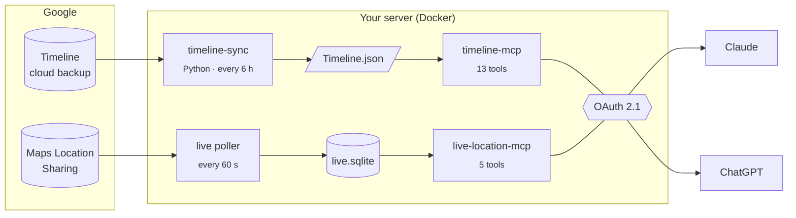

<div align="center">

# 📍 location-platform

**Ask your AI assistant where you've been — and where you are right now.**

Self-hosted [MCP](https://modelcontextprotocol.io) servers that turn your Google Maps Timeline
and live location into tools for Claude, ChatGPT, or any MCP client.


</div>

---

## Why

Google stopped offering Timeline on the web, and your location history now lives only on your
phone (plus an encrypted cloud backup). This project pulls that history back out, keeps it on
**your own server**, and lets an LLM answer questions about it — alongside a separate live feed
for "where am I right now?".

## What you can ask

> **"Where was I last Tuesday around 3pm?"**
> → `where_was_i` finds the visit or trip covering that moment.

> **"How much time did I spend at the gym in September?"**
> → `search_places` + `time_at_place` totals every visit.

> **"Summarize my week."**
> → `summarize_week` returns days, top places, distance, and how you got around.

> **"When was the last time I went to that taco place downtown?"**
> → `visit_history` lists every visit, newest first.

> **"How far did I drive this month vs. walk?"**
> → `distance_traveled` breaks it down by activity.

> **"Where am I right now, and have I moved since noon?"**
> → `where_am_i` + `movement_since` from the live feed, with data age shown.

## How it works



**History and live are deliberately two separate systems.** Timeline is Google's *semantic*
reconstruction (visits, trips, activities, Place IDs) and arrives hours late. Live Location
Sharing is raw point observations, seconds old. They live in separate databases behind separate
MCP servers and are never merged. The model picks the right tool, and every answer says how old
its data is.

## Features

| | |
|---|---|
| 🗺️ **Full Timeline history** | Syncs straight from Google's encrypted Timeline backup (no phone export, no Takeout) and follows every backup corpus, so nothing is cut off. |
| 🏷️ **Real place names** | Resolves Place IDs to names automatically after each sync. |
| 📡 **Live location** | Polls Google Maps Location Sharing through a dedicated recipient account. The session refreshes itself with cookie rotation and a persistent browser profile. |
| 🔁 **Hands-off re-auth** | When Google revokes the Timeline token, a persistent browser signs back in. The password is sealed by the host's **TPM 2.0** (`systemd-creds`), so a stolen disk or backup can't use it. It stops and asks for a human on any CAPTCHA or unexpected challenge. |
| 🔐 **Two auth layers** | Google credentials never leave the server. MCP clients get only short-lived, audience-bound OAuth 2.1 tokens (RFC 9728 discovery, PKCE, JWKS verification). |
| 🎚️ **Precision controls** | Three levels with a per-server cap on what an LLM may see: `semantic` (place names only, no coordinates), `approximate` (~1 km), or `exact`. |
| 🧾 **Logs that can't leak** | Structured logs with automatic redaction of tokens, cookies, keys, and anything that looks like a coordinate. |
| 🧪 **Synthetic by default** | Every test and fixture uses invented coordinates. A leak scanner checks the repo for secrets and real locations. |
| 🐳 **One `docker compose up`** | OAuth server, both MCP servers, the poller, the sync scheduler, and noVNC browser views. Ports bind to `127.0.0.1` only. |
| 💬 **ChatGPT without exposure** | Optional [OpenAI Secure MCP Tunnel](https://developers.openai.com/api/docs/guides/secure-mcp-tunnels) services: an outbound-only connection, with nothing published to the internet. |

## Tools

<table>
<tr><th>timeline-mcp (history)</th><th>live-location-mcp (now)</th></tr>
<tr valign="top"><td>

| Tool | |
|---|---|
| `where_was_i` | A point in time |
| `visits` · `timeline_between` | A day or range |
| `summarize_day` · `summarize_week` | Digests |
| `search_places` · `visit_history` | Find a place |
| `time_at_place` | Total dwell time |
| `visits_near` | Radius search |
| `trips` · `activities` | Movement |
| `distance_traveled` | Distance by mode |
| `timeline_status` | Data freshness |

</td><td>

| Tool | |
|---|---|
| `where_am_i` | Latest fix |
| `recent_locations` | Points in a window |
| `where_was_i_recently` | Nearest fix to a time |
| `movement_since` | Distance and moves |
| `location_status` | Poller health |

</td></tr>
</table>

Every tool is read-only and annotated as such. There is no SQL, file access, or bulk-export
tool.

## Quick start

Try it with **synthetic data**. No Google account needed.

```bash
git clone --recurse-submodules https://github.com/blakepennel/location-platform.git
cd location-platform
npm install
cd timeline-sync && python -m venv .venv && .venv/bin/pip install -e ".[dev]" && cd ..
cp .env.example .env

npm run seed   # invented Timeline + live observations
npm run dev    # OAuth :8700 · timeline-mcp :8701 · live-location-mcp :8702
```

Point an MCP client at `http://localhost:8701/mcp` or `http://localhost:8702/mcp`. It discovers
the OAuth server and opens a sign-in page. For Claude Code, the stdio transport skips OAuth
entirely; see [DEVELOPMENT.md](DEVELOPMENT.md).

**Running it for real** (a home server, your own Google data):

```bash
docker compose up -d --build
```

[DOCKER.md](DOCKER.md) walks through the one-time Google steps, the noVNC browser logins, TPM
setup for automatic re-auth, and connecting Claude and ChatGPT.

## Project layout

```
location-platform/
├── timeline-sync/       Python · syncs + decrypts the Timeline backup (wraps arkenoi/timeline-export)
├── timeline-mcp/        TypeScript · historical MCP server over its own SQLite index
├── live-location-mcp/   TypeScript · live poller + MCP server
├── mcp-auth/            OAuth 2.1 resource-server verifier + local dev authorization server
├── shared/              logging/redaction, time/geo, sqlite, HTTP host
├── schemas/             export contract + status JSON schemas
├── tools/               dev runner, e2e harness, seed data, leak scanner, re-auth driver
└── docker/              container entrypoints (noVNC, sync loop, Google browser)
```

## Testing

```bash
npm test           # 246 Node + ~125 Python tests
npm run test:e2e   # full stack: OAuth + both servers + a real MCP client
npm run leak-scan  # secrets and real-coordinate scan
```

## Docs

| | |
|---|---|
| [ARCHITECTURE.md](ARCHITECTURE.md) | Diagrams and data flow |
| [DOCKER.md](DOCKER.md) | Deploying on a server |
| [DEVELOPMENT.md](DEVELOPMENT.md) | Local setup and real Google onboarding |
| [AUTH.md](AUTH.md) | The two authentication layers |
| [SECURITY.md](SECURITY.md) · [THREAT_MODEL.md](THREAT_MODEL.md) | What's protected, and from whom |
| Per-project READMEs | [timeline-sync](timeline-sync/README.md) · [timeline-mcp](timeline-mcp/README.md) · [live-location-mcp](live-location-mcp/README.md) |

## Disclaimer

This is a personal project that reads **your own** data through **undocumented Google
endpoints**: the Timeline cloud backup via
[arkenoi/timeline-export](https://github.com/arkenoi/timeline-export) (a pinned submodule under
its own MIT license), and Maps Location Sharing. Google can change or block them at any time,
and using them may conflict with Google's Terms of Service. It is not affiliated with or endorsed
by Google. Use it only with accounts you own, at your own risk.

## License

[MIT](LICENSE)
