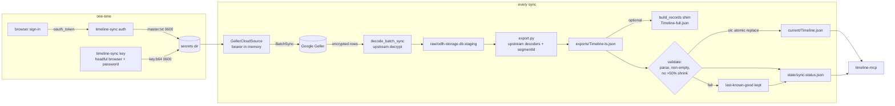

# How upstream (arkenoi/timeline-export) works

This explains the pinned upstream at `upstream/` (commit `3c1faa0`) well enough to reason about
what `timeline-sync` wraps and where it can break. Nothing here is new research: it is a
reading of upstream's README and scripts plus the shape of our own wrapper.

## What the data is

Since 2024 Google Maps Timeline lives **on the phone** ("on-device Location History", ODLH). The
phone keeps a SQLite store, `odlh-storage.db`, with one table, `semantic_segment_table`; each row
is one *segment* whose `semantic_segment` column is a protobuf (`LocationHistorySegmentProto`):

| `segment_type` | Meaning | Payload |
|---|---|---|
| 1 | visit | place candidate: FeatureId (cellId, fprint), semantic type, probability, location |
| 2 | activity | start/end location, distance, mode (walking, vehicle, cycling, ...), probability |
| 3 | timelinePath | ~2 h buckets of raw points (packed E7 lat/lng + minute offsets) |
| 4 | trip | just a name (`trip_<unix>`) |

Phones periodically **back that store up, end-to-end encrypted, to Google**. The backup is what
upstream retrieves. It is *not* real-time: Google only has what the phone last uploaded.

## Two ways to get the database

```
PATH A - direct cloud ("Geller"), what timeline-sync uses
  your browser sign-in ──► oauth_token ──► master token (long-lived, kept on disk, mode 600)
                                              │  perform_oauth, ~1 h bearer, in memory only
                                              ▼
  Geller BatchSync (gRPC/HTTP2) ──► encrypted GellerE2eeElement rows ──AES-256-GCM(key)──► odlh-storage.db
                                                                         ▲
                              key.b64 (one-time, headful browser + password re-auth)

PATH B - old container path (upstream appendix, NOT used here)
  redroid (Android 14 in Docker, Linux kernel only) + Play Services + Magisk hacks
     └─ sign in, "Import backup" in Maps UI (fixed-coordinate taps) ──► odlh-storage.db inside container
     └─ docker exec cat ──► odlh-storage.db
```

Path B needs no token or key (Play Services does the work) but is heavy, Linux-only, and lags by
the backup/import cycle. Path A talks to Google directly, in Python, anywhere. Both end with the
same file, so everything downstream is identical. `timeline-sync`'s `LocalDbSource` accepts a
database produced by path B.

## Authentication (path A)

1. **oauth_token**: sign in *normally in your own browser* at
   `https://accounts.google.com/embedded/setup/android?source=com.google.android.gms&xoauth_display_name=Android%20Device`.
   The page ends up blank; Google leaves a single-use `oauth_token` cookie (`oauth2_4/...`).
   Upstream never automates this step (Google blocks automation).
2. **master token**: `gpsoauth.exchange_token(email, oauth_token, android_id)` returns
   `{"Token": "aas_et/..."}`. It is a long-lived account credential: treat it like a password.
   `android_id` is just a 16-hex id the tokens bind to; generate once, persist, reuse forever.
3. **bearer**: `gpsoauth.perform_oauth(email, master, android_id, service=SCOPE, app=APP, client_sig=CLIENT_SIG)`
   returns `{"Auth": "ya29...."}`, valid ~1 h. `SCOPE` is `oauth2:https://www.googleapis.com/auth/webhistory`;
   `APP`/`CLIENT_SIG` are the Google Play services identity (constants in `get_token.py`).

If the master token dies (password change, revoked device) `perform_oauth` returns
`BadAuthentication`; the fix is to redo step 1-2 (`timeline-sync auth`).

## The key (path A, one time)

The payload is encrypted with a 32-byte AES key belonging to the `on_device_location_history`
*security domain*. `web_key.py` retrieves it by loading the same Google-hosted page Play Services
uses (`accounts.google.com/encryption/unlock/android?kdi=...`) in Chromium with a `window.mm` JS
shim standing in for Android's WebView bridge, and capturing `setVaultSharedKeys`. Google inserts a
**password re-auth challenge**, so it must run **headful** and a human types the password. The key
is domain-wide and stable (it records an epoch); `extract_key.py` is an alternative that reads the
same key from an already enrolled Android device.

## The fetch (path A, every sync)

`geller_fetch.py` POSTs a hand-built protobuf, gRPC-framed, to
`https://geller-pa.googleapis.com/geller.oneplatform.GellerService/BatchSync` over HTTP/2:

* `content-type: application/grpc` (exactly; `+proto` returns 404), `authorization: Bearer <ya29...>`
* request: `SyncItem{dataType=79 (ENCRYPTED_ONDEVICE_LOCATION_HISTORY)}` in `BatchSyncRequest`,
  `clientId="SEMANTICLOCATION"`. No sync token means "give me everything": the response is a
  **complete snapshot**, so every fetch replaces the whole database.

Response unwrapping (all in `snapshots()` / `rows_of()`):

```
gRPC frame(s)  [flag byte (1 = gzip) + 4-byte length + message]
 └ BatchSyncResponse{ items=1 }
    └ SyncResponseItem{ syncResult=2, dataType=3 }
       └ SyncResult{ mutations=5, results=6, syncToken=8 }
          └ GellerElement{ elementId=2, payload=3 }
             └ GellerAny{ type_url, value }               type_url contains GellerE2eeElement
                └ GellerE2eeElement{ encryptedData=1 }
                   └ AES-256-GCM decrypt: 12-byte IV || ciphertext+tag     (key.b64)
                      └ GellerAny{ ExternalDbSync } → ExternalDbSync{ snapshot=3 }
                         └ ExternalDbSnapshot{ table=1, columns=4 (strings), rows=5, dbId=6 }
                            └ row values {1 int | 2 double | 3 string | 4 bytes | 5 bool}
                               └ column "semantic_segment" → LocationHistorySegmentProto
```

`write_db()` then builds a fresh SQLite file with the same table layout Play Services uses
(atomically, via `.tmp` + `os.replace`).

## The decode (`odlh_export.py`)

Reads the database and emits `{"semanticSegments": [...]}` in Google's own export shape: ISO-8601
times with the segment's UTC offset, `"lat°, lng°"` strings, place ids derived from FeatureId
(`placeId = base64url(0x0a 0x12 0x09 <cellId LE64> 0x11 <fprint LE64>)`, the familiar `ChIJ...`).
Notable rules: deleted segments (field 4) are skipped; fields 7/8 are UTC offsets in minutes
(negative = sign-extended 10-byte varint); timelinePath rows carry no offset and inherit the last
seen one (seed `120`); `build()` drops `segment_id` for non-trip segments (why we reimplement its
loop).

## Script map

| Script | Role | Used by timeline-sync |
|---|---|---|
| `get_token.py` | oauth_token -> master -> bearer; constants `SCOPE/APP/CLIENT_SIG`; `oauth_token_from_browser`, `resolve_android_id` | constants + helpers imported; `auth` command |
| `web_key.py` | one-time headful key retrieval (Node + puppeteer-core) | `key` command, through a runtime shim |
| `extract_key.py` | key from an enrolled device / container | no |
| `geller_fetch.py` | BatchSync + decrypt + `write_db` | functions imported; `main()` re-orchestrated in `sources.py` |
| `odlh_export.py` | db -> Timeline JSON | per-type decoders imported; loop reimplemented in `export.py` |
| `build_records.py` | enriched visits, `trips[]`, `movements[]` | `sync --enrich`, through a Windows shim |
| `resolve_names.js`, `place_names.py`, `get_consent_cookie.sh` | place names (browser / Places API) | no (optional, not wired) |
| `travel_mode.py` | modal-split report | no |
| `export_all.sh`, `fetch_and_export.sh`, `setup.sh`, `login.sh`, `reimport.sh`, `redroid/*` | shell glue and the container path | no |

## Data flow inside timeline-sync



## Known fragilities of upstream

* Google's private Geller API, the key page and the `weblogin` flow can change at any time.
* `web_key.py` passes the self-signing-in URL as a `node` command-line argument (visible to other
  local processes for the duration of the run) and prints a truncated post-sign-in URL; our shim
  hides that printed line.
* `geller_fetch.rows_of` decodes ExternalDbSnapshot field 4 entries directly as strings.
* Several upstream scripts open JSON with the locale encoding; on Windows that corrupts `°`.
  See `UPSTREAM.md` for every shim.
